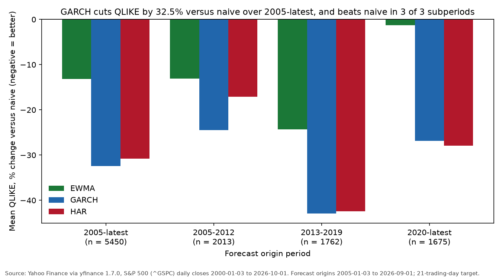
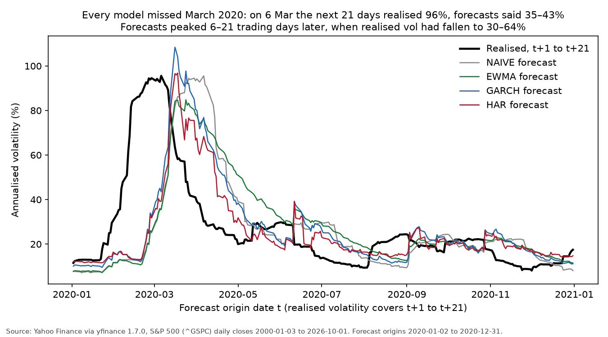
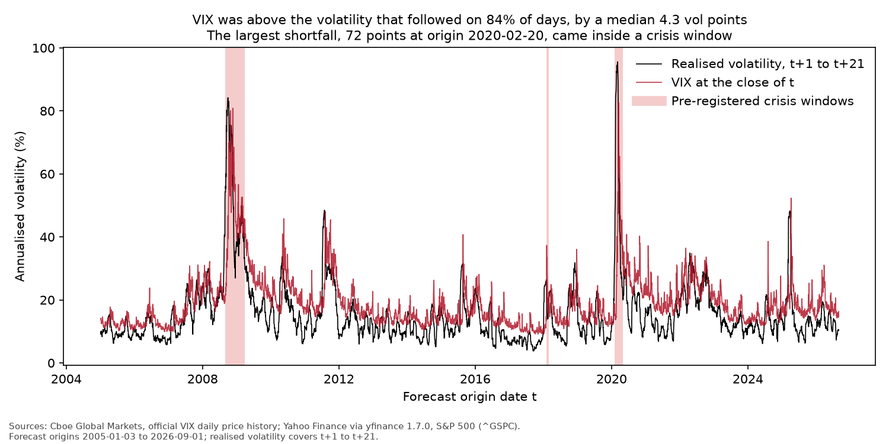
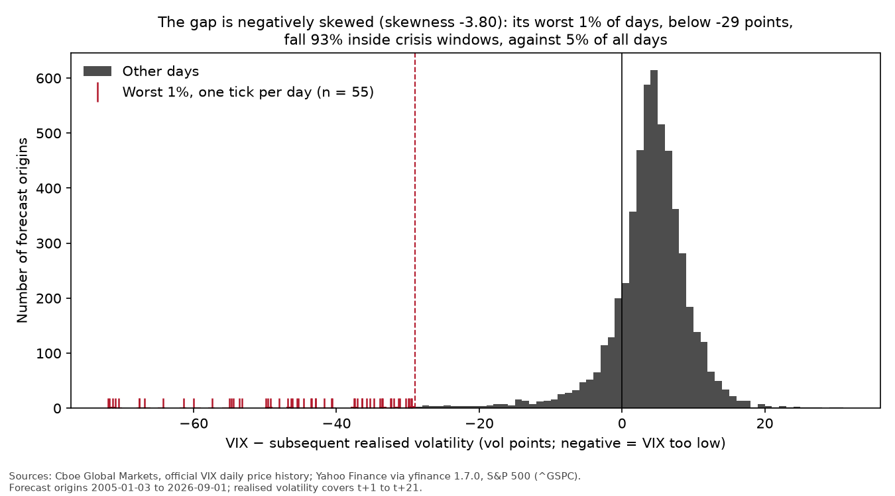

# Block 1 results: forecast accuracy

_Generated by `research/block1_forecasts.py` from the tables in `results/`. Do not edit by hand._

- **Data:** Yahoo Finance via yfinance 1.7.0, S&P 500 (^GSPC) daily closes, 2000-01-03 to 2026-10-01 (6727 rows), downloaded 2026-10-02.
- **Out-of-sample:** 5450 forecast origins, 2005-01-03 to 2026-09-01.
- **Target:** realised volatility of daily log returns from t+1 to t+21, sqrt(252 × mean squared return).
- **Tests:** one-sided Diebold-Mariano, Newey-West standard errors with 20 lags, p-values from the normal approximation. Losses are on annualised variance.

## How it was done

1. **Data.** Daily S&P 500 closes from Yahoo, turned into daily log returns.
2. **Forecasts.** On every trading day t from 2005, each model forecasts the next 21 days of volatility using only returns up to t. GARCH and HAR are re-estimated at the start of each month on data up to that day. A test checks that changing any data after t leaves the forecast at t unchanged.
3. **Scoring.** Each forecast is compared with the volatility that actually followed. QLIKE is the primary loss: it punishes under-forecasting a spike more than over-forecasting a calm spell, and it is not dominated by a handful of extreme days. MSE is secondary.
4. **Testing.** A Diebold-Mariano test asks whether one model's average loss is lower than another's by more than chance would explain. Consecutive 21-day targets overlap, so neighbouring errors are correlated; Newey-West standard errors correct for that.

## H1. At least one model beats the naive forecast

> H0: E[QLIKE(model) − QLIKE(naive)] = 0. H1: < 0. One-sided DM test for each of EWMA, GARCH and HAR. **Supported** if at least one model has lower QLIKE with Bonferroni-adjusted p < 0.0167. Otherwise **not supported**.

| Model | Benchmark | Mean QLIKE difference | DM statistic | One-sided p | Bonferroni p |
|---|---|---|---|---|---|
| EWMA | NAIVE | -0.0699 | -2.82 | 0.0024 | 0.0073 |
| GARCH | NAIVE | -0.1724 | -5.00 | < 0.0001 | < 0.0001 |
| HAR | NAIVE | -0.1637 | -3.66 | 0.0001 | 0.0004 |

**Verdict: supported.**

## H2. At a 21-day horizon, mean-reverting models beat EWMA

> One-sided DM tests of GARCH vs EWMA and HAR vs EWMA. **Supported** if both have lower QLIKE than EWMA with p < 0.05. **Contradicted** if EWMA has lower QLIKE than both. Otherwise **inconclusive**.

| Model | Benchmark | Mean QLIKE difference | DM statistic | One-sided p |
|---|---|---|---|---|
| GARCH | EWMA | -0.1024 | -2.88 | 0.0020 |
| HAR | EWMA | -0.0937 | -2.11 | 0.0175 |

**Verdict: supported.**

## Losses, 2005-latest

| Model | Mean QLIKE | QLIKE vs naive | Mean MSE (variance) | MSE vs naive |
|---|---|---|---|---|
| NAIVE | 0.5309 | +0.0% | 0.00599 | +0.0% |
| EWMA | 0.4610 | -13.2% | 0.00514 | -14.2% |
| GARCH | 0.3586 | -32.5% | 0.00526 | -12.0% |
| HAR | 0.3673 | -30.8% | 0.00459 | -23.4% |

## Mincer-Zarnowitz regressions, 2005-latest

Realised variance regressed on forecast variance. An unbiased forecast has a = 0 and b = 1; b below 1 means the forecast moves too much. No hypothesis attached.

| Model | a (SE) | b (SE) | Wald p, a = 0 and b = 1 | R² |
|---|---|---|---|---|
| NAIVE | 0.0170 (0.0042) | 0.532 (0.135) | 0.0002 | 0.283 |
| EWMA | 0.0136 (0.0039) | 0.626 (0.131) | 0.0017 | 0.305 |
| GARCH | 0.0127 (0.0042) | 0.598 (0.127) | 0.0040 | 0.324 |
| HAR | 0.0075 (0.0048) | 0.757 (0.153) | 0.2530 | 0.315 |

## By subperiod

Reported without a hypothesis. Subperiods are assigned by forecast origin date.

### 2005-2012

**Losses**

| Model | Mean QLIKE | QLIKE vs naive | Mean MSE (variance) | MSE vs naive |
|---|---|---|---|---|
| NAIVE | 0.3620 | +0.0% | 0.00502 | +0.0% |
| EWMA | 0.3146 | -13.1% | 0.00483 | -3.9% |
| GARCH | 0.2733 | -24.5% | 0.00476 | -5.2% |
| HAR | 0.3000 | -17.1% | 0.00482 | -4.0% |

**Against naive** (Bonferroni over 3 comparisons)

| Model | Benchmark | Mean QLIKE difference | DM statistic | One-sided p | Bonferroni p |
|---|---|---|---|---|---|
| EWMA | NAIVE | -0.0474 | -2.39 | 0.0085 | 0.0254 |
| GARCH | NAIVE | -0.0886 | -3.10 | 0.0010 | 0.0029 |
| HAR | NAIVE | -0.0620 | -1.34 | 0.0894 | 0.2682 |

**Against EWMA**

| Model | Benchmark | Mean QLIKE difference | DM statistic | One-sided p |
|---|---|---|---|---|
| GARCH | EWMA | -0.0413 | -2.40 | 0.0083 |
| HAR | EWMA | -0.0147 | -0.40 | 0.3444 |

**Mincer-Zarnowitz**

| Model | a (SE) | b (SE) | Wald p, a = 0 and b = 1 | R² |
|---|---|---|---|---|
| NAIVE | 0.0139 (0.0047) | 0.718 (0.132) | 0.0092 | 0.516 |
| EWMA | 0.0114 (0.0056) | 0.770 (0.166) | 0.1251 | 0.503 |
| GARCH | 0.0101 (0.0057) | 0.772 (0.160) | 0.1948 | 0.511 |
| HAR | 0.0059 (0.0080) | 0.902 (0.226) | 0.7208 | 0.465 |

### 2013-2019

**Losses**

| Model | Mean QLIKE | QLIKE vs naive | Mean MSE (variance) | MSE vs naive |
|---|---|---|---|---|
| NAIVE | 0.6350 | +0.0% | 0.000376 | +0.0% |
| EWMA | 0.4804 | -24.3% | 0.000311 | -17.4% |
| GARCH | 0.3627 | -42.9% | 0.000344 | -8.6% |
| HAR | 0.3656 | -42.4% | 0.000332 | -11.8% |

**Against naive** (Bonferroni over 3 comparisons)

| Model | Benchmark | Mean QLIKE difference | DM statistic | One-sided p | Bonferroni p |
|---|---|---|---|---|---|
| EWMA | NAIVE | -0.1546 | -3.59 | 0.0002 | 0.0005 |
| GARCH | NAIVE | -0.2723 | -3.14 | 0.0008 | 0.0025 |
| HAR | NAIVE | -0.2694 | -2.46 | 0.0070 | 0.0209 |

**Against EWMA**

| Model | Benchmark | Mean QLIKE difference | DM statistic | One-sided p |
|---|---|---|---|---|
| GARCH | EWMA | -0.1177 | -1.98 | 0.0238 |
| HAR | EWMA | -0.1148 | -1.36 | 0.0866 |

**Mincer-Zarnowitz**

| Model | a (SE) | b (SE) | Wald p, a = 0 and b = 1 | R² |
|---|---|---|---|---|
| NAIVE | 0.0112 (0.0017) | 0.320 (0.088) | < 0.0001 | 0.102 |
| EWMA | 0.0096 (0.0020) | 0.413 (0.111) | < 0.0001 | 0.121 |
| GARCH | 0.0083 (0.0021) | 0.397 (0.093) | < 0.0001 | 0.136 |
| HAR | 0.0058 (0.0024) | 0.465 (0.098) | < 0.0001 | 0.129 |

### 2020-latest

**Losses**

| Model | Mean QLIKE | QLIKE vs naive | Mean MSE (variance) | MSE vs naive |
|---|---|---|---|---|
| NAIVE | 0.6245 | +0.0% | 0.013 | +0.0% |
| EWMA | 0.6165 | -1.3% | 0.0106 | -18.8% |
| GARCH | 0.4566 | -26.9% | 0.011 | -15.3% |
| HAR | 0.4499 | -28.0% | 0.00878 | -32.7% |

**Against naive** (Bonferroni over 3 comparisons)

| Model | Benchmark | Mean QLIKE difference | DM statistic | One-sided p | Bonferroni p |
|---|---|---|---|---|---|
| EWMA | NAIVE | -0.0081 | -0.13 | 0.4477 | 1.0000 |
| GARCH | NAIVE | -0.1679 | -3.13 | 0.0009 | 0.0026 |
| HAR | NAIVE | -0.1746 | -2.60 | 0.0047 | 0.0141 |

**Against EWMA**

| Model | Benchmark | Mean QLIKE difference | DM statistic | One-sided p |
|---|---|---|---|---|
| GARCH | EWMA | -0.1598 | -1.69 | 0.0456 |
| HAR | EWMA | -0.1666 | -1.59 | 0.0557 |

**Mincer-Zarnowitz**

| Model | a (SE) | b (SE) | Wald p, a = 0 and b = 1 | R² |
|---|---|---|---|---|
| NAIVE | 0.0296 (0.0075) | 0.288 (0.108) | < 0.0001 | 0.083 |
| EWMA | 0.0255 (0.0072) | 0.386 (0.128) | < 0.0001 | 0.102 |
| GARCH | 0.0235 (0.0065) | 0.394 (0.102) | < 0.0001 | 0.149 |
| HAR | 0.0189 (0.0065) | 0.539 (0.137) | 0.0001 | 0.152 |

## Figures

## Files

- `block1_forecasts.csv`: realised volatility and every model's out-of-sample forecast, annualised, indexed by origin date t (input to Block 2)
- `block1_losses.csv`, `block1_dm.csv` (QLIKE and MSE), `block1_mz.csv`: the tables above
- `data_manifest.json`: data source, download date, range, row count and checksum

<!-- BLOCK 2: generated by research/block2_vrp.py -->

# Block 2 results: implied vs realised volatility

_Generated by `research/block2_vrp.py` from the `block2_*.csv` tables in `results/`. Do not edit by hand._

> **This is not an options trading backtest.** It compares volatility levels: VIX against the realised volatility that followed. There are no option prices, transaction costs, margin or P&L, and a positive average gap does not mean a short-volatility strategy would have made money after costs and tail losses.

- **VIX:** Cboe Global Markets, official VIX daily price history, daily close, 1990-01-02 to 2026-10-01 (9285 rows), downloaded 2026-10-02. Converted from volatility points to decimals; tables show vol points.
- **Sample:** 5450 of Block 1's 5450 out-of-sample origins have a VIX close on the same date (2005-01-03 to 2026-09-01). 287 of them are in a crisis window, meaning some day of their 21-day target window falls inside one.
- **Forecasts:** Block 1's saved out-of-sample forecasts. No model was refitted.
- **Tests:** Newey-West standard errors with 20 lags, p-values from the normal approximation.

## How it was done

1. **Data.** Cboe's official VIX closing values, matched to each forecast date t. VIX_t is the market's price for volatility over roughly the next month, set at the close of t.
2. **The gap.** For each day, VIX_t minus the realised volatility of the next 21 trading days. If option buyers pay a premium for protection, the gap is positive on average.
3. **Does the forecast add anything?** Realised volatility is regressed on VIX and the HAR forecast together. If the forecast's coefficient is positive and significant, it knows something VIX did not already price.
4. **The tail.** How skewed the gap is, and whether its worst days cluster in the pre-registered crisis windows.
5. **Robustness.** H3 and H4 repeated without crisis-window days, and H4 repeated with the EWMA and GARCH forecasts.

## H3. A variance risk premium exists

> H0: E[VIX_t − RV(t+1, t+21)] = 0. H1: > 0. One-sided t-test on the mean gap, Newey-West standard errors. **Supported** if p < 0.05. Otherwise **not supported**.

| Sample | Days | Mean VIX − RV (vol pts) | Median (vol pts) | Share VIX > RV | NW t | One-sided p |
|---|---|---|---|---|---|---|
| all | 5450 | +3.46 | +4.33 | 83.6% | 8.75 | < 0.0001 |
| ex-crisis | 5163 | +4.04 | +4.39 | 85.5% | 15.60 | < 0.0001 |

**Verdict (all days): supported.** The ex-crisis row is robustness only.

## H4. The forecast contains information that VIX does not

> RV(t+1, t+21) = a + b·VIX_t + c·F_t + e, where F is the HAR forecast made at the close of t. H0: c = 0. H1: c > 0. Newey-West standard errors. **Supported** if c > 0 with p < 0.05. Otherwise **not supported**.

| Sample | Forecast F | Role | a (SE) | b on VIX (SE) | c on F (SE) | One-sided p, c > 0 | R² |
|---|---|---|---|---|---|---|---|
| all | HAR | primary | -0.0208 (0.0132) | 0.698 (0.069) | 0.247 (0.122) | 0.0216 | 0.517 |
| all | EWMA | robustness | -0.0108 (0.0102) | 0.779 (0.104) | 0.116 (0.105) | 0.1354 | 0.513 |
| all | GARCH | robustness | -0.0093 (0.0095) | 0.667 (0.083) | 0.224 (0.110) | 0.0207 | 0.518 |
| ex-crisis | HAR | primary | 0.0014 (0.0069) | 0.662 (0.054) | 0.115 (0.067) | 0.0414 | 0.448 |
| ex-crisis | EWMA | robustness | 0.0096 (0.0058) | 0.652 (0.059) | 0.089 (0.055) | 0.0544 | 0.448 |
| ex-crisis | GARCH | robustness | 0.0074 (0.0058) | 0.642 (0.064) | 0.107 (0.066) | 0.0524 | 0.449 |

**Verdict (HAR, all days): supported.** EWMA, GARCH and ex-crisis rows are robustness only.

## H5. The premium has a fat left tail

> The distribution of VIX − RV is negatively skewed, and most of its worst 1% of days fall inside the crisis windows. Descriptive: sample skewness, and the share of the worst 1% of days inside crisis windows.

| Days | Skewness of VIX − RV | Worst 1%: days | Worst 1%: threshold (vol pts) | Worst 1% inside crisis windows | All days inside crisis windows |
|---|---|---|---|---|---|
| 5450 | -3.80 | 55 | -28.99 | 92.7% | 5.3% |

**Verdict: supported.** HYPOTHESES.md gives H5 as a descriptive claim with no significance test, so this verdict reads the claim literally: supported only if both parts hold (skewness below 0, and more than half of the worst 1% of days inside crisis windows).

## Engine thresholds: descriptive check

Spread = VIX_t − HAR forecast, bucketed at the engine's unchanged thresholds (+0.10 rich, -0.05 cheap). For each bucket, the share of days on which realised volatility came in below VIX.

| Bucket | Days | Share of days | Share with RV below VIX |
|---|---|---|---|
| rich (spread > +0.10) | 113 | 2.1% | 93.8% |
| between (-0.05 to +0.10) | 5245 | 96.2% | 83.5% |
| cheap (spread < -0.05) | 92 | 1.7% | 79.3% |

**Descriptive only, not evidence of predictive power.** The spread and the outcome both contain VIX: a high VIX makes the spread large and also makes 'RV below VIX' more likely, whatever the forecast knows. H4 is the formal test.

## Figures

## Known limitations (from HYPOTHESES.md)

- Daily close-to-close realised volatility is a noisy target, which lowers the power of every test.
- VIX is a model-free variance measure across all strikes, not at-the-money implied volatility, which is what the engine uses.
- VIX covers 30 calendar days; the target covers 21 trading days.
- This compares volatilities. It is not an options trading backtest.

## Files

- `block2_h3.csv`, `block2_h4.csv`, `block2_h5.csv`, `block2_engine.csv`: the tables above. Raw VIX values stay in `data/` and are not committed.
